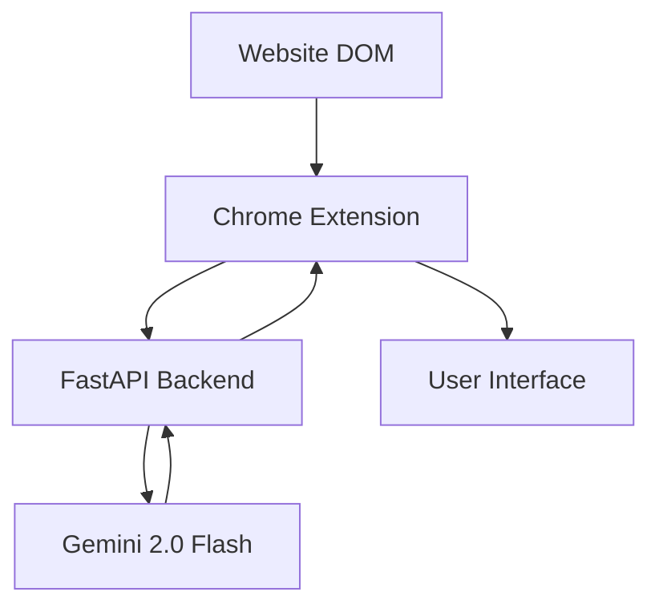

# Aura: The AI Cognitive Companion (iNTUition 2026)

Aura is a real-time interface accessibility bridge designed to reduce cognitive load and break down digital barriers for users with diverse abilities. It acts as an intelligent "Explainer" wrapper that distills complex web interfaces into meaningful, actionable summaries.

## 🚀 Key Features
- **Intelligent Explainer:** Real-time page summarization and action mapping using Gemini 2.0 Flash.
- **DOM Distillation:** Accessibility-focused filtering of web elements for efficient AI processing.
- **Action Mapping:** Natural language interface for finding and interacting with page elements.
- **Modular Design:** Built to support personalized accessibility profiles.

## 🧠 Architecture Flow


## 🛠️ Project Structure
- `backend/`: FastAPI engine providing AI reasoning and DOM distillation.
- `extension/`: Chrome extension for real-time page interaction and user interface.
- `frontend/`: (Development) Web-based dashboard or landing page.

---

## 🚦 Getting Started

### 1. Prerequisites
- **Python:** 3.12+ (managed via `uv`)
- **Node.js:** 20+ (with `npm`)
- **API Key:** A Google Gemini API Key.

### 2. Backend Setup
The backend handles the core logic, including DOM distillation and AI interaction.

```bash
cd backend
# Create .env from template
cp .env.template .env
# Edit .env and add your GEMINI_API_KEY

# Install dependencies and run the server
export PYTHONPATH=.
uv run uvicorn app.main:app --reload
```
- **API URL:** `http://localhost:8000`
- **Verification:** `uv run python verify_backend.py`

### 3. Extension Setup
The extension is the primary way users interact with Aura.

```bash
cd extension
npm install
npm run build
```
#### Loading the Extension:
1. Open Chrome and navigate to `chrome://extensions/`.
2. Enable **Developer mode** (toggle in the top right).
3. Click **Load unpacked**.
4. Select the `extension/dist` folder.

### 4. Frontend Setup
A web-based interface (under development).

```bash
cd frontend
npm install
npm run dev
```
- **URL:** `http://localhost:5173`

---

## 🧪 Verification
To ensure everything is working correctly, you can run the backend health check and verification script:

1. **Check Health:** `curl http://localhost:8000/health`
2. **Run Tests:**
   ```bash
   cd backend
   uv run python verify_backend.py
   ```

## ⚖️ Judging Criteria Focus
- **Impact:** Directly addresses cognitive load and rigid UI failures by providing a flexible AI bridge.
- **Innovation:** Uses LLMs for dynamic semantic mapping rather than static rules.
- **Performance:** Optimized through DOM distillation to ensure low-latency Gemini 2.0 Flash responses.
