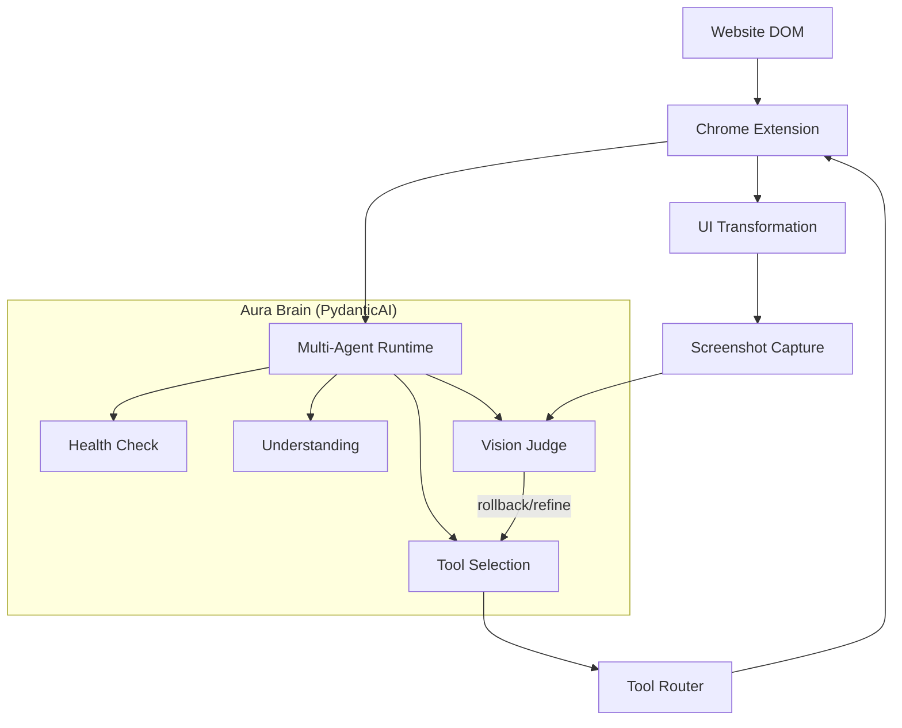

# Aura: The AI Accessibility Runtime (iNTUition 2026)

Aura is a proactive, agentic accessibility layer designed to break down digital barriers for users with visual, motor, and cognitive needs. Moving beyond static screen readers, Aura acts as an intelligent **"Adaptive Runtime"** that semantically understands and physically transforms web interfaces in real-time.

## 🚀 Key Features
- **Multi-Agent "Aura Brain":** A PydanticAI-powered pipeline implementing a structured OODA loop (Observe-Orient-Decide-Act) to handle complex accessibility reasoning.
- **Theme Adaptation Engine:** Real-time transformation into **Dark Mode** or **High Contrast Mode** with smart media protection (preserving images/videos).
- **Vision Verification Loop:** A self-correcting "Eye" that captures screenshots after adaptations to visually verify layout integrity and accessibility improvements.
- **Tool Execution Router:** A safe, structured registry of accessibility tools (the "Hand") that allows the AI to manipulate the environment without executing raw code.
- **Surgical DOM Augmentation:** Real-time UI enhancement including **Target Upscaling** and **Bionic Reading** without breaking site functionality.
- **Persistent Accessibility Identity:** Granular user profiles (Cognitive, Motor, Sensory) stored in a backend database to drive personalized adaptations.
- **Continuous Feedback Loop:** Built-in "helpful?" verification and one-click UI reversibility.
- **Speculative Execution:** Link-hover prefetching to hide LLM latency.
- **Multimodal Interaction:** Voice wake-up ("Hey Aura"), Text-to-Speech (TTS) with real-time token streaming.

## 🧠 Architecture Flow


## 🛠️ Project Structure
- `backend/`: FastAPI + PydanticAI engine. Reorganized into modular `/api/v1` endpoints with centralized `config.py`.
- `extension/`: Chrome extension with Shadow DOM isolation, a draggable floating window, and real-time streaming UI.
- `docs/`: Technical specifications including the `agentic_framework.md` and `ROADMAP.md`.

---

## 🚦 Getting Started

### 1. Prerequisites
- **Python:** 3.12+ (managed via `uv`)
- **Node.js:** 20+
- **API Key:** Google Gemini API Key.

### 2. Backend Setup
```bash
cd backend
cp .env.template .env
# Configure your GEMINI_API_KEY in .env
uv sync --all-groups
uv run uvicorn app.main:app --reload
```
- **Tests:** `uv run pytest`

### 3. Extension Setup
```bash
cd extension
cp .env.template .env
npm install
npm run build
```
#### Loading the Extension:
1. Open Chrome and navigate to `chrome://extensions/`.
2. Enable **Developer mode**.
3. Click **Load unpacked** and select `extension/dist`.

---

## ⚖️ Judging Criteria Alignment
- **Impact:** Measurably reduces user burden through structural UI simplification and physical UI healing.
- **Performance:** Real-time token streaming + Speculative Prefetching + Optimized Bundling.
- **Innovation:** Multi-agent "Closed-Loop" vision verification and safe tool-calling architecture.
- **Design:** Modern glassmorphism UI isolated via Shadow DOM for zero-conflict integration.