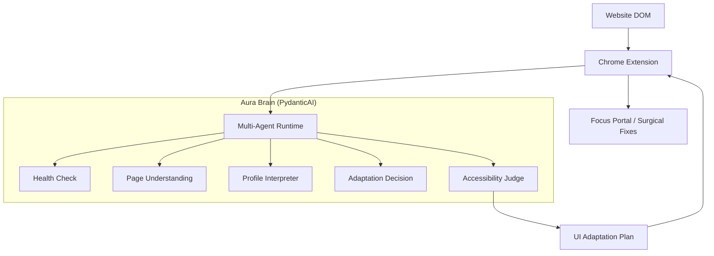

# Aura: The AI Accessibility Runtime (iNTUition 2026)

Aura is a proactive, agentic accessibility layer designed to break down digital barriers for users with visual, motor, and cognitive needs. Moving beyond static screen readers, Aura acts as an intelligent **"Adaptive Runtime"** that semantically understands and physically transforms web interfaces in real-time.

## 🚀 Key Features
- **Multi-Agent "Aura Brain":** A PydanticAI-powered pipeline implementing a structured OODA loop (Observe-Orient-Decide-Act) to handle complex accessibility reasoning.
- **Surgical DOM Augmentation:** Real-time UI enhancement including **Target Upscaling** (enlarging small buttons) and **Semantic Annotations** without breaking site functionality.
- **Persistent Accessibility Identity:** Granular user profiles (Cognitive, Motor, Sensory) stored in a backend database to drive personalized adaptations.
- **Continuous Feedback Loop:** Built-in "helpful?" verification and one-click reversibility to ensure the AI respects user agency.
- **Speculative Execution:** Link-hover prefetching to hide LLM latency, resulting in near-instant assistance.
- **Multimodal Interaction:** Voice wake-up ("Hey Aura"), Text-to-Speech (TTS), and Haptic-ready feedback.

## 🧠 Architecture Flow


## 🛠️ Project Structure
- `backend/`: FastAPI + PydanticAI engine providing the multi-agent reasoning and identity store.
- `extension/`: Chrome extension providing the content script (DOM Bridge) and Side Panel UI.
- `docs/`: Technical specifications including the `agentic_framework.md`.

---

## 🚦 Getting Started

### 1. Prerequisites
- **Python:** 3.12+ (managed via `uv`)
- **Node.js:** 20+
- **API Key:** A Google Gemini API Key.

### 2. Backend Setup
```bash
cd backend
cp .env.template .env
# Add your GEMINI_API_KEY to .env
export PYTHONPATH=.
uv run uvicorn app.main:app --reload
```
- **Verification:** `uv run python verify_runtime.py`

### 3. Extension Setup
```bash
cd extension
npm install
npm run build
```
#### Loading the Extension:
1. Open Chrome and navigate to `chrome://extensions/`.
2. Enable **Developer mode**.
3. Click **Load unpacked** and select `extension/dist`.

---

## ⚖️ Judging Criteria Alignment
- **Impact:** Measurably reduces user burden through structural UI simplification and proactive intervention.
- **Performance:** Optimized through a consolidated single-request agent and intelligent mock fallbacks.
- **Innovation:** Uses a multi-agent "Judge-and-Act" loop for self-validating accessibility adaptations.
- **Design:** Modern Adaptive Card UI integrated into the persistent Chrome Side Panel.
