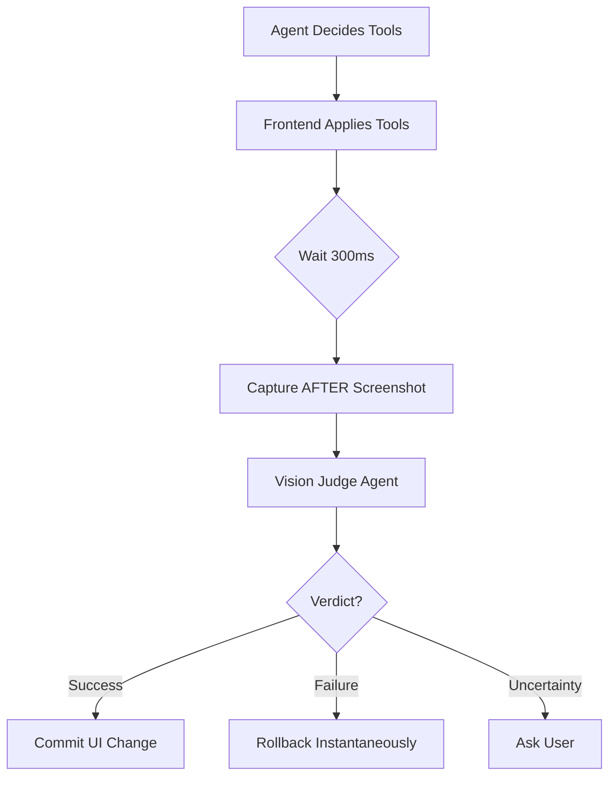

# Aura: Agentic Architecture & Vision

This document outlines the architectural principles and pipelines for Aura's evolution from a reactive explainer to a **proactive, robust accessibility agent**.

---

## 🏗️ Core Architectural Principles

These 12 keys distinguish Aura as a research-grade system rather than a fragile demo.

### 1. Separate Thinking From Acting
*   **Role of LLM:** Decision maker only.
*   **Role of Runtime:** Deterministic executor.
*   **Anti-Pattern:** LLM writing raw CSS or JS code to be `eval()`'d.
*   **Pattern:** LLM selects a tool (`ApplyFocusMode`) -> Runtime executes pre-verified CSS.

### 2. Structured Outputs Everywhere
*   Never rely on free-form text parsing.
*   Always use **Pydantic Models** or strict **JSON Schemas**.
*   *Why?* Prevents "hallucinated" behaviors and ensures type safety in the backend.

### 3. Hard Heuristic Gating
*   **Phase 0:** Cheap heuristics (Scroll loops, Rage clicks, Time-on-page) determine *if* the expensive AI agent should run.
*   *Why?* Reduces latency, cost, and false positives.

### 4. Confidence-Based Control
*   Every agent action includes a `confidence_score` (0.0 - 1.0).
*   **Policy:**
    *   `> 0.8`: Auto-execute (Proactive).
    *   `0.5 - 0.8`: Suggest to user (Reactive).
    *   `< 0.5`: Do nothing or fallback to safe mode.

### 5. Instant Rollback Mechanism
*   The system acts on the assumption that it *will* fail eventually.
*   **Requirement:** Every `Apply` action must have a corresponding, instant `Revert` action.
*   **State Tracking:** Store `previousTheme`, `previousCSS`, and `previousLayout` before any mutation.

### 6. Multi-Agent Role Boundaries
*   Avoid a single monolithic "God Agent". Use specialized sub-agents:
    *   **Assessment Agent:** "What is the user struggling with?"
    *   **Adaptation Agent:** "How do we fix it?"
    *   **Vision Judge Agent:** "Did we break the UI?"

### 7. Structured Memory
*   Do not rely on raw chat logs.
*   **Schema:** `UserPreferences` | `PageContext` | `AdaptationHistory`.

### 8. Full Observability
*   Log the *decision chain*, not just the error.
*   *Trace:* Trigger (Rage Click) -> Assessment (High Cognitive Load) -> Decision (Simplify Layout) -> Tool (Focus Mode).

### 9. Minimal Agent Count
*   More agents != better system.
*   **Limit:** 1-3 agents per interaction loop to minimize latency and compounding errors.

### 10. Design For Failure
*   Assume the LLM misunderstands, the tool fails, or the UI breaks.
*   **Safety Net:** The "Vision Judge" is the final line of defense.

### 11. Deterministic Tool Chains
*   Prefer stable pipelines over creative planning.
*   **Example:** `Distill -> Explain -> Act` is better than "Figure out what to do with these 10 tools."

### 12. Multimodal Verification
*   The system must "see" what it did. Text-based DOM analysis is insufficient for verifying layout shifts or visual overlap.

---

## 👁️ The Vision Judge Pipeline

A closed-loop verification system to ensure accessibility improvements do not break usability.

### The Flow


### 1. Capture Strategy
*   **Two States:** Always capture `before.png` and `after.png` for comparison.
*   **Timing:** Introduce a ~300ms delay after applying tools to allow for CSS transitions and reflows.
*   **Optimization:** Track the modified DOM region and crop screenshots to that area (e.g., just the navigation bar) to reduce token usage and noise.

### 2. Pre-Processing
*   **Resolution:** Resize to 768px width (sufficient for layout verification, cheaper for LLM).
*   **Format:** Convert to grayscale if color isn't the primary variable, further reducing noise.

### 3. Judge Input Schema
The Judge receives structured context, not just pixels:
```json
{
  "goal": "Improve readability by reducing clutter",
  "tools_applied": ["FocusMode", "IncreaseFontSize"],
  "previous_issues": ["Low contrast", "Dense text block"]
}
```

### 4. The Judge Prompt
> **Role:** You are an accessibility verification agent.
> **Task:** Compare BEFORE and AFTER screenshots. Evaluate if accessibility improved without breaking usability.
> **Checklist:**
> 1. Is text readable?
> 2. Is the layout clear?
> 3. Are key actions still visible?
> 4. Are there visual overlaps or broken elements?
> **Constraint:** Do NOT evaluate aesthetics. Focus purely on functional accessibility.

### 5. Output Schema
```python
class VisionJudgeResult(BaseModel):
    success: bool
    improvements: list[str]
    regressions: list[str]
    confidence: float
    recommendation: Literal["commit", "rollback", "refine"]
```

### 6. Decision Policy
*   **Commit:** `success=True` AND `regressions=[]`.
*   **Rollback:** `success=False` OR `critical_regression=True`.
*   **Refine:** `confidence > 0.7` but minor regression detected -> Trigger `RepairAgent`.

---

## 🚀 Implementation Roadmap

1.  **Phase 1 (Current):** Basic "Struggle Detection" and deterministic Tool execution.
2.  **Phase 2:** Implement the `VisionJudgeAgent` using `pydantic-ai` and Gemini 1.5 Pro (Vision).
3.  **Phase 3:** Build the "Instant Rollback" state manager in the Chrome Extension.
4.  **Phase 4:** Connect the closed loop: Trigger -> Act -> Verify -> Commit/Revert.
